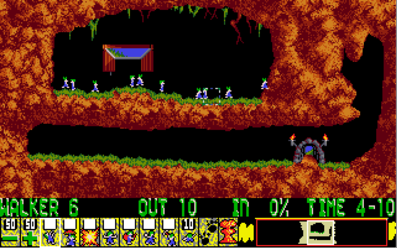
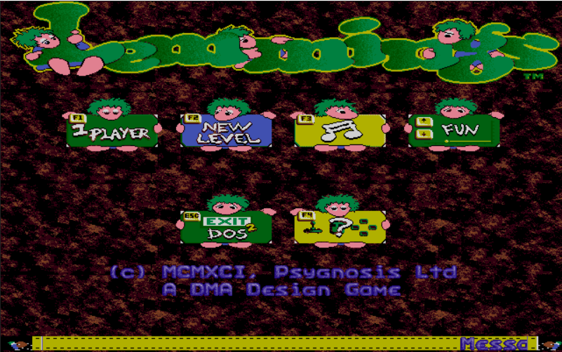
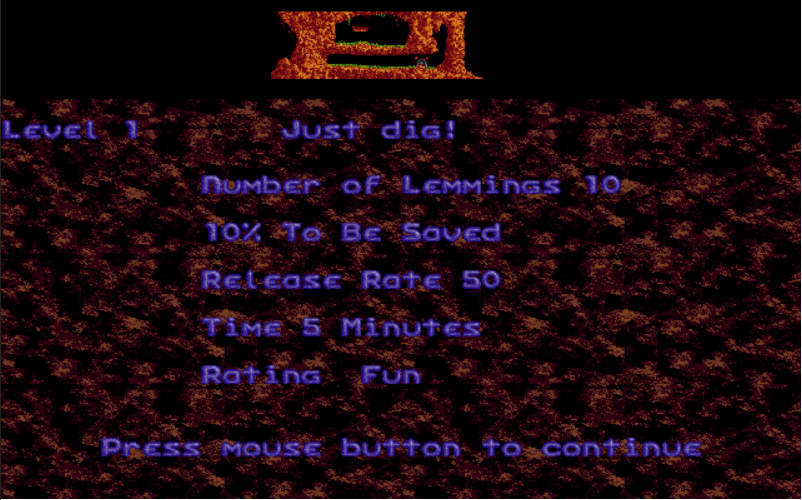
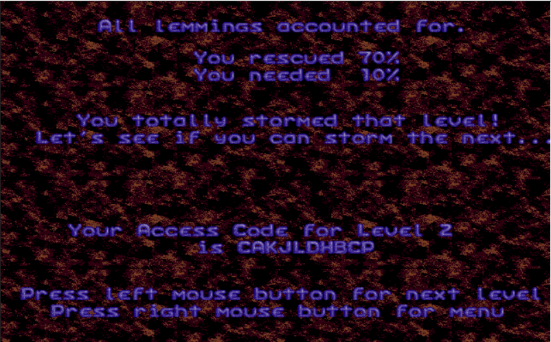
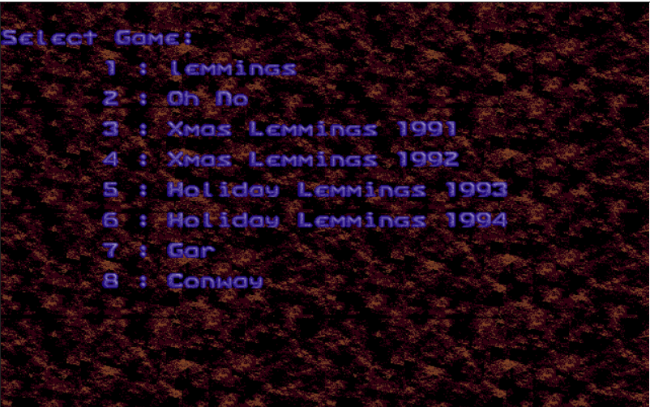
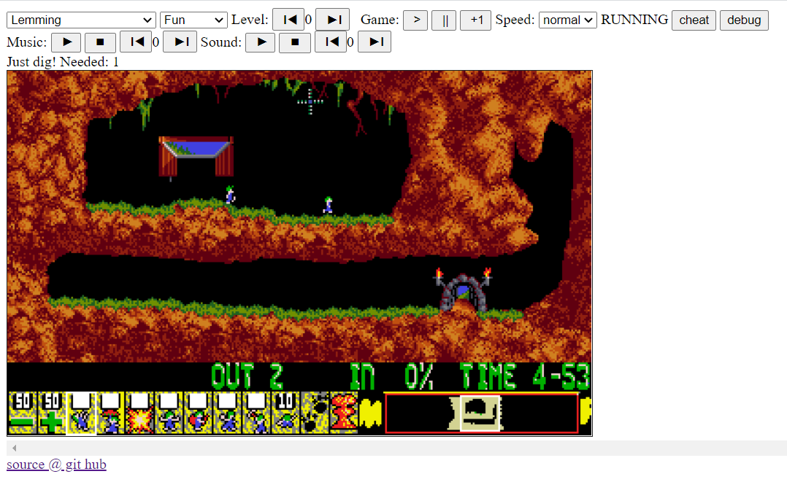

# Lemmings.ts
A Web Lemmings Clone/Remake in TypeScript 
Forked from tomsoftware/Lemmings.ts

The goal is to finish it and extand it to custom levels like the ones present here:
<a href="http://www.garjen.co.uk/Lemmings.php/">[Custom levels]</a>

<a href="http://tfumey.free.fr/lem/lemmings.html">[Play the game]</a> 
<a href="http://tfumey.free.fr/lem/debug.html">[browse levels and versions with debug version]</a> 
<a href="http://lemmings.hmilch.net/">[Play the original tomsoftware game]</a>

## Feature
* Browser Game
* Support all variants of Lemmings Game
* Read original Lemmings binaries on the fly
* Support playing of original music by interpreting the adlib.dat file and using an Adlib emulator(s) (DosBox or Robson Cozendey )

## Improvements since fork
* Map added on game page
* Mouse cursor added with color palette
* Long touch support
* No need to change code to add new levels, use only config.json
* Level presentation page added (objective)
* Result page added
* Original mouse navigation added
* Welcome page of each game added with mouse and touch pad support
* Game selection page added with mouse and touch pad support

## ToDo
* finish welcome page (Reel)
* automate music and sound
* trap animation not triggered, sound to be added
* killing machine do not start right lemming animation, right sound to be added
* explosion should not destroy some hard part of the level
* manage "one way" objects for bathers and miners
* fix some game issues (some killing leming ojects are not triggered (hanging, rolling...))

## How to run
* download the *Lemmings.ts.zip* from <a href="https://github.com/thomasfum/Lemmings.ts/releases">[releases]</a>
* copy the original *Lemmings*, *OhNo* and *Holiday* binaries into the directory **run/{version}/**
* start *lemmings.html*
* start *debug.html* for debug version

## How to compile
* you need TypeScript to compile the code to JavaScript

## State

# Disclaimer
Disclaimer: This Project does not claim rights to any Lemmings Version. To the best of our/my knowledge, these titles have been discontinued by their publishers. If you know otherwise, please contact us/me and we will remove them accordingly. Thank you for your attention. See the LICENSE for more information.

## Standing on the shoulders of giants
Special thanks goes to:
- DMA for the original game
- Volker Oth, ccexplore and Mindless for their work on reverse engineering the Lemmings Level and Grafic Formats
- DosBox for there OPL emulator
- Robson Cozendey for his Java OPL3 emulator
- tomsoftware for the original ts version
- https://www.camanis.net/lemmings/files/docs/lemmings_main_dat_file_format.txt
- https://www.camanis.net/lemmings/files/docs/lemmings_lvl_file_format.txt
- https://www.camanis.net/lemmings/files/docs/lemmings_vgagrx_dat_groundxo_dat_file_format.txt
